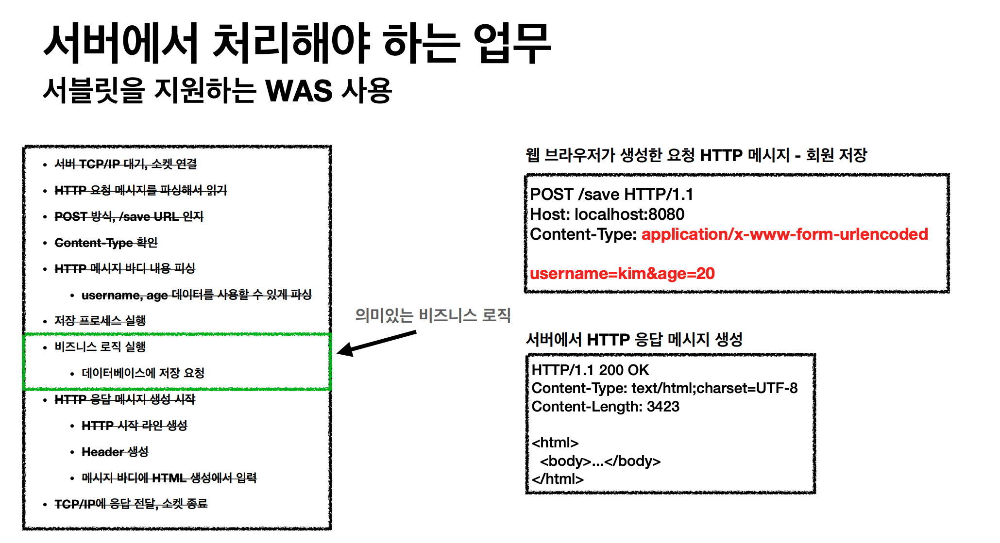

```java
@WebServlet(name = "helloServlet", urlPatterns = "/hello")
public class HelloServlet extends HttpServlet {
 @Override
 protected void service(HttpServletRequest request, HttpServletResponse response){
 //애플리케이션 로직
 }
}
```

- urlPatterns(/hello)의 URL이 호출되면 서블릿 코드가 실행
- HTTP 요청 정보를 편리하게 사용할 수 있는 HttpServletRequest
- HTTP 응답 정보를 편리하게 제공할 수 있는 HttpServletResponse
- 개발자는 HTTP 스펙을 매우 편리하게 사용


# HTTP 요청시
- WAS는 Request, Response 객체를 새로 만들어서 서블릿 객체 호출
- 개발자는 Request 객체에서 HTTP 요청 정보를 편리하게 꺼내서 사용
- 개발자는 Response 객체에 HTTP 응답 정보를 편리하게 입력
- WAS는 Response 객체에 담겨있는 내용으로 HTTP 응답 정보를 생성

# 서블릿 컨테이너
